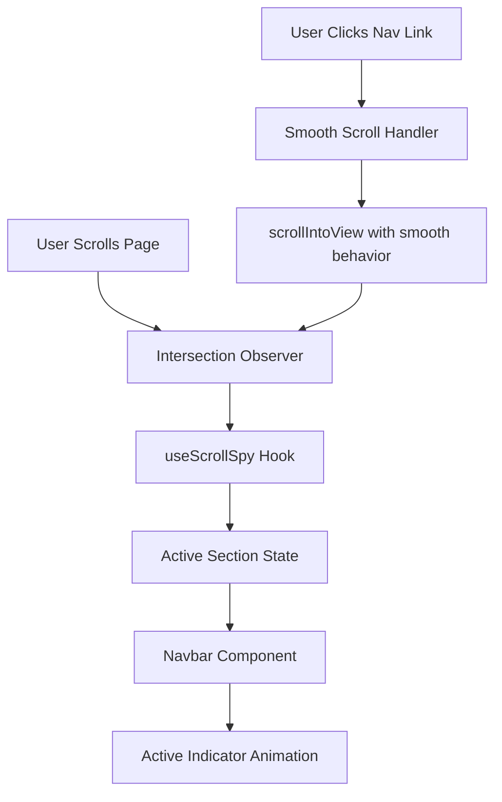

# Design Document: Scroll-Spy Navbar

## Overview

This design document specifies the implementation of a scroll-spy navigation bar feature for a Next.js application. The feature provides smooth scrolling navigation between page sections with automatic active state detection and animated visual feedback.

The implementation leverages the Intersection Observer API for performant section visibility tracking, Framer Motion for smooth animations, and React hooks for state management. The design integrates with the existing navbar component while maintaining TypeScript type safety and accessibility standards.

### Key Features

- Smooth scroll navigation with 800ms animation duration
- Automatic active section detection using Intersection Observer API (50% visibility threshold)
- Animated active indicator using Framer Motion layoutId (300ms transition)
- Sticky navbar positioning with Tailwind CSS
- Custom useScrollSpy hook for reusable scroll tracking logic
- Full TypeScript type safety
- ARIA attributes for accessibility
- Performance optimization with React.memo and useMemo

### Sections Tracked

The navbar will track and navigate between five main sections:
- Vision (`#vision`)
- Problem (`#problem`)
- How It Works (`#how-it-works`)
- Solution (`#solution`)
- Impact (`#impact`)

## Architecture

### Component Hierarchy

```
Navbar (existing component - enhanced)
├── Logo and Brand
├── Navigation Menu
│   ├── NavLink (Vision)
│   ├── NavLink (Problem)
│   ├── NavLink (How It Works)
│   ├── NavLink (Solution)
│   └── NavLink (Impact)
│       └── ActiveIndicator (Framer Motion)
└── CTA Button

useScrollSpy Hook (new)
├── Intersection Observer Setup
├── Section Visibility Tracking
└── Active Section State Management
```

### Data Flow



### Module Structure

```
src/
├── components/
│   └── common/
│       └── navbar.tsx (enhanced)
├── hooks/
│   └── useScrollSpy.ts (new)
└── types/
    └── navigation.ts (new)
```

## Components and Interfaces

### 1. useScrollSpy Hook

**Purpose:** Custom React hook that tracks which section is currently visible in the viewport using the Intersection Observer API.

**Location:** `src/hooks/useScrollSpy.ts`

**Interface:**

```typescript
interface UseScrollSpyOptions {
  sectionIds: string[];
  threshold?: number;
  rootMargin?: string;
}

interface UseScrollSpyReturn {
  activeSection: string | null;
}

function useScrollSpy(options: UseScrollSpyOptions): UseScrollSpyReturn;
```

**Parameters:**
- `sectionIds`: Array of section element IDs to observe
- `threshold`: Intersection threshold (default: 0.5 for 50% visibility)
- `rootMargin`: Root margin for the observer (default: "0px 0px -50% 0px")

**Return Value:**
- `activeSection`: The ID of the currently active section, or null if none

**Behavior:**
1. Creates an Intersection Observer on mount
2. Observes all elements matching the provided section IDs
3. Updates active section when intersection changes
4. When multiple sections are visible, selects the topmost one
5. Cleans up observer on unmount
6. Handles missing DOM elements gracefully

**Implementation Details:**
- Use `useEffect` to set up and tear down the Intersection Observer
- Use `useState` to manage the active section
- Use `useRef` to store observer instance
- Implement logic to determine topmost section when multiple are visible
- Use `threshold: 0.5` to require 50% visibility
- Use `rootMargin: "0px 0px -50% 0px"` to adjust the effective viewport

### 2. Enhanced Navbar Component

**Purpose:** Navigation bar with scroll-spy functionality, smooth scrolling, and animated active state indicator.

**Location:** `src/components/common/navbar.tsx`

**Interface:**

```typescript
interface NavSection {
  id: string;
  label: string;
  href: string;
}

interface NavbarProps {
  sections?: NavSection[];
}
```

**Props:**
- `sections`: Optional array of section configurations (defaults to standard five sections)

**State:**
- `activeSection`: Current active section from useScrollSpy hook

**Behavior:**
1. Renders navigation links for all configured sections
2. Calls useScrollSpy hook to track active section
3. Handles click events to trigger smooth scrolling
4. Displays animated active indicator on the current section's link
5. Maintains existing logo, branding, and CTA button

**Styling:**
- Uses Tailwind CSS for all styling
- Sticky positioning: `sticky top-0 z-50`
- Background with backdrop blur for visibility over content
- Horizontal layout for navigation links

### 3. NavLink Component

**Purpose:** Individual navigation link with active state styling and smooth scroll behavior.

**Location:** `src/components/common/navbar.tsx` (internal component)

**Interface:**

```typescript
interface NavLinkProps {
  section: NavSection;
  isActive: boolean;
  onClick: (sectionId: string) => void;
}
```

**Props:**
- `section`: Section configuration object
- `isActive`: Whether this link represents the active section
- `onClick`: Click handler for smooth scrolling

**Behavior:**
1. Renders as semantic anchor element
2. Sets `aria-current="true"` when active
3. Calls onClick handler when clicked
4. Prevents default anchor behavior
5. Keyboard accessible (Tab and Enter)

**Active Indicator:**
- Uses Framer Motion's `motion.div` with `layoutId="activeIndicator"`
- Renders only when `isActive` is true
- Smooth transition with 300ms duration
- GPU-accelerated transform animations

### 4. Smooth Scroll Handler

**Purpose:** Handles smooth scrolling to target sections when navigation links are clicked.

**Location:** `src/components/common/navbar.tsx` (internal function)

**Signature:**

```typescript
function handleSmoothScroll(sectionId: string): void;
```

**Behavior:**
1. Finds the target element by ID
2. Calls `scrollIntoView` with smooth behavior
3. Uses 800ms duration (browser default for smooth)
4. Allows user scroll to interrupt animation
5. Handles missing elements gracefully

**Implementation:**

```typescript
const handleSmoothScroll = (sectionId: string) => {
  const element = document.getElementById(sectionId);
  if (element) {
    element.scrollIntoView({
      behavior: 'smooth',
      block: 'start',
    });
  }
};
```

## Data Models

### NavSection Type

```typescript
interface NavSection {
  id: string;        // HTML element ID (e.g., "vision")
  label: string;     // Display text (e.g., "Vision")
  href: string;      // Anchor href (e.g., "#vision")
}
```

**Default Configuration:**

```typescript
const DEFAULT_SECTIONS: NavSection[] = [
  { id: 'vision', label: 'Vision', href: '#vision' },
  { id: 'problem', label: 'Problem', href: '#problem' },
  { id: 'how-it-works', label: 'How It Works', href: '#how-it-works' },
  { id: 'solution', label: 'Solution', href: '#solution' },
  { id: 'impact', label: 'Impact', href: '#impact' },
];
```

### Intersection Observer Configuration

```typescript
interface ObserverConfig {
  threshold: number;      // 0.5 (50% visibility)
  rootMargin: string;     // "0px 0px -50% 0px"
  root: null;             // viewport
}
```

### Active Section State

```typescript
type ActiveSection = string | null;
```

- `string`: ID of the currently active section
- `null`: No section is currently active (e.g., at page top/bottom)

## Correctness Properties

*A property is a characteristic or behavior that should hold true across all valid executions of a system—essentially, a formal statement about what the system should do. Properties serve as the bridge between human-readable specifications and machine-verifiable correctness guarantees.*

### Property 1: Smooth Scroll Completion

*For any* valid section ID in the configured sections array, when a navigation link is clicked, the default anchor behavior should be prevented and the page should scroll to position the target section at the top of the viewport using smooth animation.

**Validates: Requirements 1.1, 1.2**

### Property 2: Active Section Reflects Viewport

*For any* scroll position where a section has at least 50% visibility in the viewport, the useScrollSpy hook should return that section's ID as the active section.

**Validates: Requirements 2.2, 2.3**

### Property 3: Topmost Section Priority

*For any* scroll position where multiple sections meet the 50% visibility threshold, the useScrollSpy hook should return the ID of the topmost visible section as the active section.

**Validates: Requirements 2.4**

### Property 4: Active Indicator Synchronization

*For any* active section state (including null), the active indicator should be rendered only on the navigation link corresponding to the active section when activeSection is not null, and should not be rendered at all when activeSection is null.

**Validates: Requirements 3.1, 3.4, 3.5**

### Property 5: Navbar Visibility Persistence

*For any* scroll position on the page, the navbar should remain visible at the top of the viewport.

**Validates: Requirements 4.1, 4.3**

### Property 6: Section Configuration Completeness

*For any* valid section configuration array, the navbar should render exactly one navigation link for each section with the correct label and href.

**Validates: Requirements 4.5, 8.2**

### Property 7: Observer Cleanup

*For any* component unmount event, the useScrollSpy hook should disconnect all Intersection Observer instances to prevent memory leaks.

**Validates: Requirements 5.3**

### Property 8: Accessibility Attribute Correctness

*For any* navigation link, it should have aria-current="true" if and only if it represents the currently active section.

**Validates: Requirements 7.2**

### Property 9: Keyboard Navigation Equivalence

*For any* navigation link, pressing Enter when the link has keyboard focus should trigger the same smooth scroll behavior as clicking the link with a mouse.

**Validates: Requirements 7.5**

### Property 10: Missing Element Resilience

*For any* section ID in the configuration that does not correspond to an existing DOM element, the useScrollSpy hook should continue to function without throwing errors and should never return that missing section ID as active.

**Validates: Requirements 8.5**

### Property 11: State Update Efficiency

*For any* sequence of intersection observer callbacks, the useScrollSpy hook should update the active section state at most once per actual section change, preventing excessive re-renders.

**Validates: Requirements 9.2**

## Error Handling

### Missing DOM Elements

**Scenario:** A configured section ID does not exist in the DOM.

**Handling:**
- useScrollSpy hook filters out null elements before observing
- Logs a warning to console in development mode
- Continues to function with remaining valid sections
- Never returns the missing section ID as active

**Implementation:**
```typescript
const elements = sectionIds
  .map(id => document.getElementById(id))
  .filter((el): el is HTMLElement => el !== null);

if (elements.length < sectionIds.length && process.env.NODE_ENV === 'development') {
  console.warn('Some section IDs were not found in the DOM');
}
```

### Intersection Observer Not Supported

**Scenario:** Browser does not support Intersection Observer API.

**Handling:**
- Check for `window.IntersectionObserver` availability
- Fallback: Return null for activeSection (no active state)
- Log warning to console
- Navbar remains functional for navigation, just without active state

**Implementation:**
```typescript
if (typeof window === 'undefined' || !window.IntersectionObserver) {
  console.warn('Intersection Observer not supported');
  return { activeSection: null };
}
```

### Scroll During Animation

**Scenario:** User scrolls manually while smooth scroll animation is in progress.

**Handling:**
- Browser's native `scrollIntoView` with `behavior: 'smooth'` automatically handles interruption
- User scroll input takes precedence
- No additional handling required

### Rapid Section Changes

**Scenario:** User scrolls very quickly through multiple sections.

**Handling:**
- Intersection Observer batches updates automatically
- React's state batching prevents excessive re-renders
- Active indicator animation uses Framer Motion's layout animation which handles rapid changes smoothly

### Invalid Section Configuration

**Scenario:** Sections prop contains invalid data (missing id or label).

**Handling:**
- TypeScript type checking prevents this at compile time
- Runtime validation in development mode
- Filter out invalid entries and log warning

**Implementation:**
```typescript
const validSections = sections.filter(section => {
  const isValid = section.id && section.label && section.href;
  if (!isValid && process.env.NODE_ENV === 'development') {
    console.warn('Invalid section configuration:', section);
  }
  return isValid;
});
```

## Testing Strategy

### Dual Testing Approach

This feature requires both unit tests and property-based tests to ensure comprehensive coverage:

- **Unit tests** verify specific examples, edge cases, and integration points
- **Property-based tests** verify universal properties across all inputs
- Together they provide comprehensive coverage: unit tests catch concrete bugs, property tests verify general correctness

### Unit Testing

**Framework:** Jest with React Testing Library

**Test Cases:**

1. **useScrollSpy Hook Tests**
   - Returns null when no sections are visible
   - Returns correct section ID when one section is 50% visible
   - Returns topmost section when multiple sections are visible
   - Cleans up observer on unmount
   - Handles empty sectionIds array
   - Handles missing DOM elements gracefully

2. **Navbar Component Tests**
   - Renders all configured navigation links
   - Renders default sections when no props provided
   - Calls smooth scroll handler on link click
   - Displays active indicator on active link only
   - Does not display active indicator when activeSection is null
   - Maintains existing logo and CTA button

3. **Smooth Scroll Tests**
   - Calls scrollIntoView with correct options
   - Handles missing target element gracefully
   - Prevents default anchor behavior

4. **Accessibility Tests**
   - Navigation links are keyboard accessible
   - Active link has aria-current="true"
   - Inactive links do not have aria-current="true"
   - Nav element has appropriate aria-label
   - Enter key triggers smooth scroll

5. **Integration Tests**
   - Active section updates when scrolling through page
   - Active indicator animates when active section changes
   - Clicking nav link scrolls to correct section
   - Navbar remains sticky during scroll

### Property-Based Testing

**Framework:** fast-check (JavaScript property-based testing library)

**Configuration:**
- Minimum 100 iterations per property test
- Each test references its design document property
- Tag format: `Feature: scroll-spy-navbar, Property {number}: {property_text}`

**Property Tests:**

1. **Property 1: Smooth Scroll Completion**
   - Generate: Random valid section IDs from configuration
   - Action: Simulate click on navigation link
   - Assert: Target section is scrolled into view
   - Tag: `Feature: scroll-spy-navbar, Property 1: Smooth scroll completion`

2. **Property 2: Active Section Reflects Viewport**
   - Generate: Random scroll positions where a section is 50%+ visible
   - Action: Trigger intersection observer callback
   - Assert: useScrollSpy returns that section's ID
   - Tag: `Feature: scroll-spy-navbar, Property 2: Active section reflects viewport`

3. **Property 3: Topmost Section Priority**
   - Generate: Random scroll positions with multiple visible sections
   - Action: Trigger intersection observer with multiple entries
   - Assert: useScrollSpy returns the topmost section's ID
   - Tag: `Feature: scroll-spy-navbar, Property 3: Topmost section priority`

4. **Property 4: Active Indicator Synchronization**
   - Generate: Random active section states (including null)
   - Action: Render navbar with active section
   - Assert: Active indicator appears only on correct link or not at all
   - Tag: `Feature: scroll-spy-navbar, Property 4: Active indicator synchronization`

5. **Property 5: Navbar Visibility Persistence**
   - Generate: Random scroll positions
   - Action: Scroll to position
   - Assert: Navbar remains visible and positioned correctly
   - Tag: `Feature: scroll-spy-navbar, Property 5: Navbar visibility persistence`

6. **Property 6: Section Configuration Completeness**
   - Generate: Random valid section configurations
   - Action: Render navbar with configuration
   - Assert: Exactly one link per section with correct label and href
   - Tag: `Feature: scroll-spy-navbar, Property 6: Section configuration completeness`

7. **Property 7: Observer Cleanup**
   - Generate: Random section ID arrays
   - Action: Mount and unmount component
   - Assert: Observer disconnect is called
   - Tag: `Feature: scroll-spy-navbar, Property 7: Observer cleanup`

8. **Property 8: Accessibility Attribute Correctness**
   - Generate: Random active section states
   - Action: Render navbar
   - Assert: aria-current is set correctly on all links
   - Tag: `Feature: scroll-spy-navbar, Property 8: Accessibility attribute correctness`

9. **Property 9: Keyboard Navigation Equivalence**
   - Generate: Random section IDs
   - Action: Simulate Enter key press vs mouse click
   - Assert: Both trigger same scroll behavior
   - Tag: `Feature: scroll-spy-navbar, Property 9: Keyboard navigation equivalence`

10. **Property 10: Missing Element Resilience**
    - Generate: Random section configurations with some non-existent IDs
    - Action: Initialize useScrollSpy hook
    - Assert: No errors thrown, missing IDs never returned as active
    - Tag: `Feature: scroll-spy-navbar, Property 10: Missing element resilience`

11. **Property 11: State Update Efficiency**
    - Generate: Random sequences of intersection events
    - Action: Trigger rapid intersection changes
    - Assert: State updates occur at most once per actual change
    - Tag: `Feature: scroll-spy-navbar, Property 11: State update efficiency`

### Performance Testing

**Metrics to Monitor:**
- Intersection Observer callback execution time
- Component re-render count during scroll
- Animation frame rate (should maintain 60fps)
- Memory usage over extended scrolling

**Performance Benchmarks:**
- useScrollSpy state update: < 16ms (one frame)
- Active indicator animation: 60fps throughout 300ms transition
- Smooth scroll: 60fps throughout 800ms animation
- No memory leaks after 1000 scroll events

### Test Coverage Goals

- Line coverage: > 90%
- Branch coverage: > 85%
- Function coverage: > 95%
- Property test iterations: 100 per property

## Implementation Notes

### Integration with Existing Navbar

The current navbar uses GSAP for link hover animations. The enhanced implementation will:
1. Preserve the existing GSAP hover animations on the AnimatedLink component
2. Replace the `isActive` logic to use the useScrollSpy hook instead of pathname matching
3. Add Framer Motion for the active indicator (separate from GSAP animations)
4. Maintain the existing layout, logo, and CTA button

### Section ID Inconsistencies

Current section components have inconsistent IDs:
- `vision.tsx`: `id='vision'` ✓
- `problem.tsx`: `id='Problem'` (should be lowercase)
- `solution.tsx`: `id='solution'` ✓
- `how-it-works.tsx`: `id='how-it-work'` (should be `how-it-works`)
- `impact.tsx`: `id='impact'` ✓

These IDs must be corrected to match the navbar configuration before the scroll-spy feature will work correctly.

### Framer Motion Setup

Install Framer Motion if not already present:
```bash
npm install framer-motion
```

Import and use in navbar:
```typescript
import { motion } from 'framer-motion';
```

### TypeScript Configuration

Create new types file at `src/types/navigation.ts`:
```typescript
export interface NavSection {
  id: string;
  label: string;
  href: string;
}

export interface UseScrollSpyOptions {
  sectionIds: string[];
  threshold?: number;
  rootMargin?: string;
}

export interface UseScrollSpyReturn {
  activeSection: string | null;
}
```

### Performance Optimizations

1. **Memoization:**
   - Wrap Navbar component with `React.memo`
   - Use `useMemo` for sections array
   - Use `useCallback` for scroll handler

2. **Intersection Observer Configuration:**
   - Use `threshold: 0.5` for 50% visibility
   - Use `rootMargin: "0px 0px -50% 0px"` to adjust effective viewport
   - Single observer instance for all sections

3. **Animation Performance:**
   - Framer Motion uses GPU-accelerated transforms
   - Active indicator uses `transform` and `opacity` only
   - No layout-triggering properties in animations

4. **State Management:**
   - Single state variable for active section
   - Intersection Observer batches updates automatically
   - React batches state updates automatically

### Browser Compatibility

- Intersection Observer: Supported in all modern browsers (Chrome 51+, Firefox 55+, Safari 12.1+)
- Smooth scroll behavior: Supported in all modern browsers (Chrome 61+, Firefox 36+, Safari 15.4+)
- Framer Motion: Supports all modern browsers
- Fallback: Feature degrades gracefully (no active state) in unsupported browsers

### Accessibility Considerations

1. **Semantic HTML:** Use `<nav>` and `<a>` elements
2. **ARIA Attributes:** `aria-current`, `aria-label`
3. **Keyboard Navigation:** Full Tab and Enter support
4. **Focus Management:** Visible focus indicators
5. **Screen Readers:** Proper link text and navigation structure

## Dependencies

### New Dependencies

- `framer-motion`: For animated active indicator (if not already installed)

### Existing Dependencies

- `react`: Core framework
- `next`: Next.js framework
- `typescript`: Type safety
- `tailwindcss`: Styling
- `@gsap/react` and `gsap`: Existing hover animations (preserved)

### Browser APIs

- Intersection Observer API
- Element.scrollIntoView()
- document.getElementById()

## Migration Path

### Phase 1: Create Hook
1. Create `src/hooks/useScrollSpy.ts`
2. Implement Intersection Observer logic
3. Add TypeScript types
4. Write unit tests for hook

### Phase 2: Update Section IDs
1. Fix inconsistent section IDs in component files
2. Ensure all IDs match navbar configuration

### Phase 3: Enhance Navbar
1. Install Framer Motion (if needed)
2. Integrate useScrollSpy hook
3. Replace pathname-based active state with scroll-spy
4. Add Framer Motion active indicator
5. Implement smooth scroll handler
6. Add accessibility attributes

### Phase 4: Testing
1. Write unit tests for navbar enhancements
2. Write property-based tests
3. Perform manual accessibility testing
4. Performance profiling

### Phase 5: Documentation
1. Add JSDoc comments to hook and components
2. Update component documentation
3. Add usage examples

## Future Enhancements

- Configurable animation durations
- Custom active indicator styles via props
- Support for nested sections
- Scroll progress indicator
- Mobile responsive navigation drawer
- URL hash synchronization
- Scroll offset configuration for fixed headers
