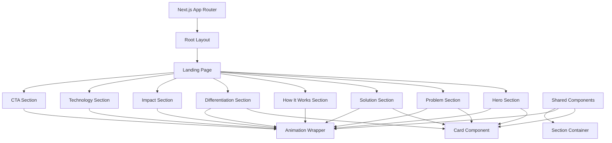

# Design Document: UMWERO Landing Website

## Overview

The UMWERO landing website is a single-page application built with Next.js 16 App Router that serves as the primary digital presence for the UMWERO AI-powered crop health intelligence platform. The website communicates the platform's value proposition to African farmers, partners, and stakeholders through an engaging, accessible, and performant user experience.

### Design Goals

1. **Immediate Value Communication**: Visitors should understand UMWERO's purpose within seconds of landing on the page
2. **Engaging Visual Experience**: Smooth animations and interactions that feel modern without sacrificing performance
3. **Accessibility First**: Ensure all content is accessible to users with disabilities and those using assistive technologies
4. **Performance Optimized**: Fast load times even on limited internet connections common in rural African regions
5. **Maintainable Architecture**: Clean, modular component structure that enables easy updates and extensions

### Technical Approach

The website follows a component-based architecture using Next.js 16's App Router with TypeScript for type safety. Framer Motion provides declarative animations while Tailwind CSS enables rapid, consistent styling. The design prioritizes server-side rendering for initial page load performance and implements progressive enhancement for animations and interactions.

## Architecture

### High-Level Architecture



### Directory Structure

```
app/
├── layout.tsx                 # Root layout with metadata
├── page.tsx                   # Landing page composition
├── globals.css                # Global styles and Tailwind imports
└── fonts/                     # Local font files

components/
├── sections/
│   ├── HeroSection.tsx
│   ├── ProblemSection.tsx
│   ├── SolutionSection.tsx
│   ├── HowItWorksSection.tsx
│   ├── DifferentiationSection.tsx
│   ├── ImpactSection.tsx
│   ├── TechnologySection.tsx
│   └── CTASection.tsx
├── ui/
│   ├── Card.tsx               # Reusable card component
│   ├── AnimatedSection.tsx    # Scroll-triggered animation wrapper
│   └── AnimatedCounter.tsx    # Number animation component
└── animations/
    └── variants.ts            # Framer Motion animation variants

lib/
├── constants.ts               # Color system, breakpoints, timing
└── utils.ts                   # Utility functions

public/
├── images/                    # Optimized images
└── icons/                     # SVG icons

tailwind.config.ts             # Tailwind configuration
tsconfig.json                  # TypeScript configuration
```

### Rendering Strategy

- **Server-Side Rendering (SSR)**: Initial page load renders all content on the server for optimal performance and SEO
- **Client-Side Hydration**: Interactive features and animations activate after hydration
- **Progressive Enhancement**: Core content accessible without JavaScript; animations enhance the experience
- **Code Splitting**: Each section component can be lazy-loaded below the fold

## Components and Interfaces

### Core Section Components

#### HeroSection Component

**Purpose**: First impression component that communicates UMWERO's core value proposition

**Props Interface**:
```typescript
interface HeroSectionProps {
  title: string;
  tagline: string;
  ctaText: string;
  ctaHref: string;
}
```

**Behavior**:
- Renders full-viewport height section with centered content
- Displays animated plant growth visualization using SVG and Framer Motion
- Plant animation triggers on mount, progressing from seed to mature plant over 2-3 seconds
- Uses primary color (#2E7D32) for plant and accent color (#F9A825) for highlights
- CTA button uses hover scale animation

#### ProblemSection Component

**Purpose**: Communicates the challenges faced by African farmers

**Props Interface**:
```typescript
interface ProblemSectionProps {
  title: string;
  problems: Array<{
    id: string;
    title: string;
    description: string;
    icon: string;
  }>;
}
```

**Behavior**:
- Renders responsive grid of problem cards (3 columns desktop, 2 tablet, 1 mobile)
- Each card uses the Card component with hover lift effect
- Fade-in animation triggers when section enters viewport
- Staggered animation for each card (0.1s delay between cards)

#### SolutionSection Component

**Purpose**: Showcases UMWERO's key features and capabilities

**Props Interface**:
```typescript
interface SolutionSectionProps {
  title: string;
  features: Array<{
    id: string;
    title: string;
    description: string;
    icon: string;
  }>;
}
```

**Behavior**:
- Renders responsive grid of feature cards
- Uses secondary color (#66BB6A) for feature highlights
- Each card includes icon, title, and description
- Hover effects on cards with scale and shadow transitions

#### HowItWorksSection Component

**Purpose**: Explains the 5-step process for using UMWERO

**Props Interface**:
```typescript
interface HowItWorksSectionProps {
  title: string;
  steps: Array<{
    id: string;
    number: number;
    title: string;
    description: string;
  }>;
}
```

**Behavior**:
- Renders sequential step indicators with connecting lines
- Staggered fade-in animation when section enters viewport (0.15s delay per step)
- Responsive layout: horizontal timeline on desktop, vertical on mobile
- Step numbers use accent color (#F9A825) for emphasis

#### DifferentiationSection Component

**Purpose**: Highlights what makes UMWERO unique for African agriculture

**Props Interface**:
```typescript
interface DifferentiationSectionProps {
  title: string;
  differentiators: Array<{
    id: string;
    feature: string;
    umwero: string;
    others: string;
  }>;
}
```

**Behavior**:
- Renders comparison table or card grid
- Emphasizes UMWERO advantages with visual indicators
- Uses primary color for UMWERO column highlights
- Responsive: table on desktop, stacked cards on mobile

#### ImpactSection Component

**Purpose**: Displays potential impact metrics and benefits

**Props Interface**:
```typescript
interface ImpactSectionProps {
  title: string;
  metrics: Array<{
    id: string;
    value: number;
    suffix: string;
    label: string;
  }>;
}
```

**Behavior**:
- Renders animated statistics that count from 0 to target value
- Animation triggers when section enters viewport
- Uses AnimatedCounter component for number animations
- Accent color (#F9A825) highlights key numbers
- Duration: 2 seconds for count-up animation

#### TechnologySection Component

**Purpose**: Explains the technical foundation in accessible terms

**Props Interface**:
```typescript
interface TechnologySectionProps {
  title: string;
  description: string;
  techStack: Array<{
    id: string;
    name: string;
    description: string;
    icon: string;
  }>;
}
```

**Behavior**:
- Renders tech stack as visual cards with icons
- Balances technical detail with accessibility for non-technical audiences
- Grid layout with hover effects on each technology card
- Includes brief explanations of AI capabilities

#### CTASection Component

**Purpose**: Encourages visitor engagement and collaboration

**Props Interface**:
```typescript
interface CTASectionProps {
  title: string;
  description: string;
  primaryCTA: {
    text: string;
    href: string;
  };
  secondaryCTA?: {
    text: string;
    href: string;
  };
}
```

**Behavior**:
- Renders prominent call-to-action with contrasting colors
- Primary CTA uses accent color (#F9A825) for maximum visibility
- Secondary CTA uses outline style with primary color
- Hover animations on both buttons
- Includes contact or engagement information

### Shared UI Components

#### Card Component

**Purpose**: Reusable container for content with consistent styling and hover effects

**Props Interface**:
```typescript
interface CardProps {
  children: React.ReactNode;
  className?: string;
  hoverable?: boolean;
  variant?: 'default' | 'outlined' | 'elevated';
}
```

**Behavior**:
- Provides consistent padding, border radius, and background
- Hoverable prop enables lift effect (translateY: -8px, shadow increase)
- Hover animation duration: 0.2-0.3 seconds
- Supports variant styles for different use cases

#### AnimatedSection Component

**Purpose**: Wrapper that triggers fade-in animations on scroll

**Props Interface**:
```typescript
interface AnimatedSectionProps {
  children: React.ReactNode;
  delay?: number;
  className?: string;
}
```

**Behavior**:
- Uses Framer Motion's viewport detection
- Triggers fade-in animation when 20% of element is visible
- Animation: opacity 0 → 1, translateY 20px → 0
- Duration: 0.5-0.8 seconds
- Respects prefers-reduced-motion media query

#### AnimatedCounter Component

**Purpose**: Animates numbers from 0 to target value

**Props Interface**:
```typescript
interface AnimatedCounterProps {
  value: number;
  duration?: number;
  suffix?: string;
  className?: string;
}
```

**Behavior**:
- Uses Framer Motion's useSpring and useTransform hooks
- Animates from 0 to target value over specified duration (default 2s)
- Formats numbers with appropriate separators
- Triggers animation when component enters viewport

### Animation Variants

**Purpose**: Centralized Framer Motion animation configurations

```typescript
// variants.ts
export const fadeInUp = {
  hidden: { opacity: 0, y: 20 },
  visible: { 
    opacity: 1, 
    y: 0,
    transition: { duration: 0.6, ease: 'easeOut' }
  }
};

export const staggerContainer = {
  hidden: { opacity: 0 },
  visible: {
    opacity: 1,
    transition: {
      staggerChildren: 0.1,
      delayChildren: 0.2
    }
  }
};

export const cardHover = {
  rest: { scale: 1, y: 0 },
  hover: { 
    scale: 1.02, 
    y: -8,
    transition: { duration: 0.3, ease: 'easeOut' }
  }
};

export const plantGrowth = {
  initial: { scale: 0, opacity: 0 },
  animate: {
    scale: 1,
    opacity: 1,
    transition: {
      duration: 2.5,
      ease: 'easeInOut',
      times: [0, 0.3, 0.6, 1]
    }
  }
};
```

## Data Models

### Content Data Structure

The website content is defined as TypeScript constants for type safety and easy updates:

```typescript
// lib/constants.ts

export const COLORS = {
  primary: '#2E7D32',      // Green - headers, key elements
  secondary: '#66BB6A',    // Light green - accents, highlights
  accent: '#F9A825',       // Gold - CTAs, emphasis
  background: '#F5F7F6',   // Light gray - page background
  text: '#1F2937',         // Dark gray - body text
  white: '#FFFFFF',
  black: '#000000'
} as const;

export const BREAKPOINTS = {
  mobile: 0,
  tablet: 768,
  desktop: 1024,
  wide: 1280
} as const;

export const ANIMATION_TIMING = {
  fast: 0.2,
  normal: 0.3,
  slow: 0.6,
  verySlow: 0.8
} as const;

export const HERO_CONTENT = {
  title: 'UMWERO',
  tagline: 'Helping Africa grow healthier crops and secure the future of food',
  ctaText: 'Learn More',
  ctaHref: '#solution'
} as const;

export const PROBLEMS = [
  {
    id: 'disease-detection',
    title: 'Late Disease Detection',
    description: 'Farmers often discover crop diseases too late, leading to significant yield losses',
    icon: '/icons/disease.svg'
  },
  {
    id: 'limited-expertise',
    title: 'Limited Agricultural Expertise',
    description: 'Access to agricultural experts is scarce in rural areas',
    icon: '/icons/expertise.svg'
  },
  {
    id: 'climate-challenges',
    title: 'Climate Variability',
    description: 'Unpredictable weather patterns make crop management difficult',
    icon: '/icons/climate.svg'
  }
] as const;

export const FEATURES = [
  {
    id: 'disease-detection',
    title: 'AI Disease Detection',
    description: 'Identify crop diseases early using smartphone camera and AI analysis',
    icon: '/icons/ai-detection.svg'
  },
  {
    id: 'crop-monitoring',
    title: 'Real-Time Monitoring',
    description: 'Track crop health and receive alerts about potential issues',
    icon: '/icons/monitoring.svg'
  },
  {
    id: 'recommendations',
    title: 'Personalized Recommendations',
    description: 'Get tailored advice based on your specific crops, soil, and location',
    icon: '/icons/recommendations.svg'
  }
] as const;

export const STEPS = [
  {
    id: 'step-1',
    number: 1,
    title: 'Capture',
    description: 'Take a photo of your crop using your smartphone'
  },
  {
    id: 'step-2',
    number: 2,
    title: 'Analyze',
    description: 'AI analyzes the image for diseases and health indicators'
  },
  {
    id: 'step-3',
    number: 3,
    title: 'Diagnose',
    description: 'Receive instant diagnosis with confidence scores'
  },
  {
    id: 'step-4',
    number: 4,
    title: 'Recommend',
    description: 'Get personalized treatment recommendations'
  },
  {
    id: 'step-5',
    number: 5,
    title: 'Monitor',
    description: 'Track progress and receive ongoing guidance'
  }
] as const;

export const DIFFERENTIATORS = [
  {
    id: 'crop-focus',
    feature: 'Crop Database',
    umwero: 'African crops (cassava, maize, beans)',
    others: 'Global crops, limited African coverage'
  },
  {
    id: 'soil-conditions',
    feature: 'Soil Analysis',
    umwero: 'Optimized for African soil conditions',
    others: 'Generic soil recommendations'
  },
  {
    id: 'connectivity',
    feature: 'Internet Requirements',
    umwero: 'Works with limited connectivity',
    others: 'Requires stable internet connection'
  }
] as const;

export const IMPACT_METRICS = [
  {
    id: 'yield-increase',
    value: 30,
    suffix: '%',
    label: 'Potential Yield Increase'
  },
  {
    id: 'early-detection',
    value: 80,
    suffix: '%',
    label: 'Earlier Disease Detection'
  },
  {
    id: 'farmers-reached',
    value: 10000,
    suffix: '+',
    label: 'Farmers to Reach in Rwanda'
  }
] as const;

export const TECH_STACK = [
  {
    id: 'nextjs',
    name: 'Next.js 16',
    description: 'Modern React framework for optimal performance',
    icon: '/icons/nextjs.svg'
  },
  {
    id: 'typescript',
    name: 'TypeScript',
    description: 'Type-safe development for reliability',
    icon: '/icons/typescript.svg'
  },
  {
    id: 'ai',
    name: 'AI/ML',
    description: 'Advanced machine learning for crop analysis',
    icon: '/icons/ai.svg'
  }
] as const;

export const CTA_CONTENT = {
  title: 'Join Us in Transforming African Agriculture',
  description: 'We\'re looking for partners, developers, and agricultural experts to help build UMWERO',
  primaryCTA: {
    text: 'Get Involved',
    href: '#contact'
  },
  secondaryCTA: {
    text: 'Learn More',
    href: '#technology'
  }
} as const;
```

### Type Definitions

```typescript
// types/index.ts

export type ColorKey = keyof typeof COLORS;
export type BreakpointKey = keyof typeof BREAKPOINTS;

export interface Problem {
  id: string;
  title: string;
  description: string;
  icon: string;
}

export interface Feature {
  id: string;
  title: string;
  description: string;
  icon: string;
}

export interface Step {
  id: string;
  number: number;
  title: string;
  description: string;
}

export interface Differentiator {
  id: string;
  feature: string;
  umwero: string;
  others: string;
}

export interface Metric {
  id: string;
  value: number;
  suffix: string;
  label: string;
}

export interface TechItem {
  id: string;
  name: string;
  description: string;
  icon: string;
}

export interface CTAButton {
  text: string;
  href: string;
}
```


## Correctness Properties

*A property is a characteristic or behavior that should hold true across all valid executions of a system—essentially, a formal statement about what the system should do. Properties serve as the bridge between human-readable specifications and machine-verifiable correctness guarantees.*

The following properties define the universal behaviors that must hold across the UMWERO landing website. These properties will be validated through property-based testing to ensure correctness across a wide range of inputs and conditions.

### Property 1: Card Hover Lift Effect

*For any* Card component rendered on the page, when a user hovers over it, the card should apply a lift effect with translateY of -8px and increased shadow elevation, and return to its original state when hover ends.

**Validates: Requirements 2.3, 10.1, 10.4**

### Property 2: Section Fade-In Animation

*For any* Section component, when it enters the viewport (20% visible), it should trigger a fade-in animation from opacity 0 to 1 with translateY from 20px to 0, completing within 0.5-0.8 seconds.

**Validates: Requirements 9.1, 9.3**

### Property 3: Interactive Element Hover Transitions

*For any* interactive element (buttons, links, clickable cards), when a user hovers over it, the element should apply a visual transition (scale or color change) that completes within 0.2-0.3 seconds and returns to original state when hover ends.

**Validates: Requirements 10.2, 10.3, 10.4**

### Property 4: Reduced Motion Accessibility

*For any* animation in the system, when the user's browser has prefers-reduced-motion enabled, the animation should be disabled or significantly reduced to respect the user's accessibility preferences.

**Validates: Requirements 9.4**

### Property 5: WCAG AA Contrast Compliance

*For any* text element and its background, the color contrast ratio should meet or exceed WCAG AA standards (4.5:1 for normal text, 3:1 for large text ≥18pt or bold ≥14pt).

**Validates: Requirements 12.5**

### Property 6: Semantic HTML Structure

*For any* section component rendered on the page, it should use semantic HTML5 elements (section, article, nav, header, footer, main) rather than generic div elements for its primary structure.

**Validates: Requirements 15.1**

### Property 7: ARIA Labels for Interactive Elements

*For any* interactive element (buttons, links, form inputs), it should include appropriate ARIA labels (aria-label, aria-labelledby, or aria-describedby) when the visual label is insufficient for screen readers.

**Validates: Requirements 15.2**

### Property 8: Keyboard Navigation Support

*For any* interactive feature on the page, it should be fully accessible via keyboard navigation (Tab, Enter, Space, Arrow keys) without requiring mouse interaction.

**Validates: Requirements 15.3**

### Property 9: Image Alternative Text

*For any* image or visual content element (img, svg with content, background images with meaning), it should include descriptive alternative text via alt attribute or aria-label.

**Validates: Requirements 15.4**

## Error Handling

### Animation Errors

**Scenario**: Framer Motion fails to load or initialize
- **Handling**: Graceful degradation - display content without animations
- **Implementation**: Use try-catch around animation initialization, provide fallback static rendering
- **User Experience**: Content remains fully accessible, just without motion effects

**Scenario**: Animation performance issues on low-end devices
- **Handling**: Detect performance and reduce animation complexity
- **Implementation**: Monitor frame rate, disable complex animations if FPS drops below 30
- **User Experience**: Smoother experience with simpler animations rather than janky complex ones

### Image Loading Errors

**Scenario**: Image fails to load (network error, missing file)
- **Handling**: Display fallback placeholder with alt text
- **Implementation**: Use Next.js Image component's onError handler, show styled placeholder
- **User Experience**: User sees descriptive text and knows content is missing, page layout remains stable

**Scenario**: Slow image loading on poor connection
- **Handling**: Progressive loading with blur placeholder
- **Implementation**: Use Next.js Image component's blur placeholder feature
- **User Experience**: User sees low-quality preview immediately, sharp image loads progressively

### Viewport Detection Errors

**Scenario**: Intersection Observer API not supported (old browsers)
- **Handling**: Polyfill or fallback to immediate animation
- **Implementation**: Check for IntersectionObserver support, use polyfill or show content immediately
- **User Experience**: Animations either work with polyfill or content appears without scroll triggers

### Responsive Layout Errors

**Scenario**: Unexpected viewport size or orientation change
- **Handling**: Re-calculate layout on resize/orientation change
- **Implementation**: Use Tailwind's responsive classes, add resize event listener for complex layouts
- **User Experience**: Layout adapts smoothly to new dimensions without breaking

### Color System Errors

**Scenario**: CSS custom properties not supported
- **Handling**: Fallback to hardcoded color values
- **Implementation**: Define colors both as CSS variables and fallback values
- **User Experience**: Consistent colors across all browsers

### Accessibility Errors

**Scenario**: Screen reader fails to announce dynamic content
- **Handling**: Use ARIA live regions for dynamic updates
- **Implementation**: Add aria-live="polite" to sections with animated counters
- **User Experience**: Screen reader users hear updates to dynamic content

**Scenario**: Keyboard focus lost during navigation
- **Handling**: Maintain focus management
- **Implementation**: Use focus-visible for clear focus indicators, manage focus on modal/overlay interactions
- **User Experience**: Keyboard users always know where focus is

## Testing Strategy

### Overview

The testing strategy employs a dual approach combining unit tests for specific examples and edge cases with property-based tests for universal behaviors. This ensures both concrete correctness (specific scenarios work) and general correctness (all scenarios work).

### Unit Testing

**Framework**: Vitest with React Testing Library

**Focus Areas**:
- Specific content rendering (hero tagline, section titles, feature descriptions)
- Component integration (sections compose correctly on landing page)
- Edge cases (empty data arrays, missing props, undefined values)
- Responsive breakpoint transitions (specific viewport sizes)
- Color application in specific contexts
- Error boundary behavior

**Example Unit Tests**:

```typescript
// Hero section renders required content
describe('HeroSection', () => {
  it('displays UMWERO name and tagline', () => {
    render(<HeroSection {...HERO_CONTENT} />);
    expect(screen.getByText('UMWERO')).toBeInTheDocument();
    expect(screen.getByText(/Helping Africa grow healthier crops/)).toBeInTheDocument();
  });

  it('includes call-to-action button', () => {
    render(<HeroSection {...HERO_CONTENT} />);
    expect(screen.getByRole('link', { name: /Learn More/i })).toBeInTheDocument();
  });
});

// Problem section renders minimum required cards
describe('ProblemSection', () => {
  it('displays at least 3 problem cards', () => {
    render(<ProblemSection problems={PROBLEMS} />);
    const cards = screen.getAllByTestId('problem-card');
    expect(cards.length).toBeGreaterThanOrEqual(3);
  });
});

// Responsive layout at specific breakpoints
describe('Responsive Layout', () => {
  it('displays 3 columns on desktop (1024px)', () => {
    global.innerWidth = 1024;
    render(<ProblemSection problems={PROBLEMS} />);
    const grid = screen.getByTestId('problem-grid');
    expect(grid).toHaveClass('md:grid-cols-3');
  });

  it('displays 1 column on mobile (375px)', () => {
    global.innerWidth = 375;
    render(<ProblemSection problems={PROBLEMS} />);
    const grid = screen.getByTestId('problem-grid');
    expect(grid).toHaveClass('grid-cols-1');
  });
});

// Color system application
describe('Color System', () => {
  it('applies primary color to headers', () => {
    render(<HeroSection {...HERO_CONTENT} />);
    const heading = screen.getByRole('heading', { level: 1 });
    expect(heading).toHaveStyle({ color: '#2E7D32' });
  });

  it('applies accent color to CTA buttons', () => {
    render(<CTASection {...CTA_CONTENT} />);
    const button = screen.getByRole('button', { name: /Get Involved/i });
    expect(button).toHaveStyle({ backgroundColor: '#F9A825' });
  });
});
```

**Unit Test Guidelines**:
- Focus on specific examples rather than exhaustive input coverage
- Test integration between components
- Verify edge cases (empty arrays, null values, extreme viewport sizes)
- Keep tests readable and maintainable
- Avoid over-testing implementation details

### Property-Based Testing

**Framework**: fast-check (JavaScript property-based testing library)

**Configuration**:
- Minimum 100 iterations per property test
- Each test tagged with comment referencing design property
- Tag format: `// Feature: umwero-landing-website, Property {number}: {property_text}`

**Property Test Implementation**:

```typescript
import fc from 'fast-check';

// Property 1: Card Hover Lift Effect
describe('Property 1: Card Hover Lift Effect', () => {
  it('applies lift effect on hover and returns to original state', () => {
    // Feature: umwero-landing-website, Property 1: Card hover lift effect
    fc.assert(
      fc.property(
        fc.record({
          children: fc.string(),
          className: fc.option(fc.string(), { nil: undefined }),
          hoverable: fc.boolean()
        }),
        (props) => {
          const { container } = render(<Card {...props} />);
          const card = container.firstChild as HTMLElement;
          
          // Record original position
          const originalTransform = window.getComputedStyle(card).transform;
          
          // Simulate hover
          fireEvent.mouseEnter(card);
          
          if (props.hoverable !== false) {
            // Should have lift effect
            const hoverTransform = window.getComputedStyle(card).transform;
            expect(hoverTransform).not.toBe(originalTransform);
            expect(hoverTransform).toContain('translateY');
          }
          
          // Simulate hover end
          fireEvent.mouseLeave(card);
          
          // Should return to original state
          const finalTransform = window.getComputedStyle(card).transform;
          expect(finalTransform).toBe(originalTransform);
        }
      ),
      { numRuns: 100 }
    );
  });
});

// Property 2: Section Fade-In Animation
describe('Property 2: Section Fade-In Animation', () => {
  it('triggers fade-in when entering viewport within timing constraints', () => {
    // Feature: umwero-landing-website, Property 2: Section fade-in animation
    fc.assert(
      fc.property(
        fc.record({
          children: fc.string(),
          delay: fc.option(fc.double({ min: 0, max: 1 }), { nil: undefined })
        }),
        async (props) => {
          const { container } = render(<AnimatedSection {...props} />);
          const section = container.firstChild as HTMLElement;
          
          // Initially should be hidden or low opacity
          const initialOpacity = parseFloat(window.getComputedStyle(section).opacity);
          expect(initialOpacity).toBeLessThan(1);
          
          // Simulate entering viewport
          mockIntersectionObserver(section, true);
          
          // Wait for animation
          await waitFor(() => {
            const finalOpacity = parseFloat(window.getComputedStyle(section).opacity);
            expect(finalOpacity).toBe(1);
          }, { timeout: 1000 }); // Max 0.8s + buffer
        }
      ),
      { numRuns: 100 }
    );
  });
});

// Property 3: Interactive Element Hover Transitions
describe('Property 3: Interactive Element Hover Transitions', () => {
  it('applies hover transition within timing constraints', () => {
    // Feature: umwero-landing-website, Property 3: Interactive element hover transitions
    fc.assert(
      fc.property(
        fc.oneof(
          fc.constant('button'),
          fc.constant('link'),
          fc.constant('card')
        ),
        fc.string(),
        (elementType, content) => {
          const Component = getInteractiveComponent(elementType);
          const { container } = render(<Component>{content}</Component>);
          const element = container.firstChild as HTMLElement;
          
          const startTime = performance.now();
          fireEvent.mouseEnter(element);
          
          // Check transition duration is within 0.2-0.3s
          const transitionDuration = window.getComputedStyle(element).transitionDuration;
          const durationMs = parseFloat(transitionDuration) * 1000;
          expect(durationMs).toBeGreaterThanOrEqual(200);
          expect(durationMs).toBeLessThanOrEqual(300);
          
          // Should return to original on mouse leave
          fireEvent.mouseLeave(element);
          const finalStyle = window.getComputedStyle(element);
          expect(finalStyle.transform).toBe('none');
        }
      ),
      { numRuns: 100 }
    );
  });
});

// Property 4: Reduced Motion Accessibility
describe('Property 4: Reduced Motion Accessibility', () => {
  it('disables animations when prefers-reduced-motion is enabled', () => {
    // Feature: umwero-landing-website, Property 4: Reduced motion accessibility
    fc.assert(
      fc.property(
        fc.constantFrom('hero', 'problem', 'solution', 'impact'),
        (sectionType) => {
          // Mock prefers-reduced-motion
          window.matchMedia = jest.fn().mockImplementation(query => ({
            matches: query === '(prefers-reduced-motion: reduce)',
            media: query,
            addEventListener: jest.fn(),
            removeEventListener: jest.fn()
          }));
          
          const Section = getSectionComponent(sectionType);
          const { container } = render(<Section />);
          
          // Check that animations are disabled
          const animatedElements = container.querySelectorAll('[data-animated]');
          animatedElements.forEach(element => {
            const style = window.getComputedStyle(element);
            expect(style.animation).toBe('none');
            expect(style.transition).toBe('none');
          });
        }
      ),
      { numRuns: 100 }
    );
  });
});

// Property 5: WCAG AA Contrast Compliance
describe('Property 5: WCAG AA Contrast Compliance', () => {
  it('maintains sufficient contrast for all text-background combinations', () => {
    // Feature: umwero-landing-website, Property 5: WCAG AA contrast compliance
    fc.assert(
      fc.property(
        fc.constantFrom('hero', 'problem', 'solution', 'cta'),
        (sectionType) => {
          const Section = getSectionComponent(sectionType);
          const { container } = render(<Section />);
          
          // Get all text elements
          const textElements = container.querySelectorAll('p, h1, h2, h3, h4, h5, h6, span, a, button');
          
          textElements.forEach(element => {
            const style = window.getComputedStyle(element);
            const textColor = style.color;
            const bgColor = getBackgroundColor(element);
            const fontSize = parseFloat(style.fontSize);
            const fontWeight = style.fontWeight;
            
            const contrastRatio = calculateContrastRatio(textColor, bgColor);
            
            // Large text (≥18pt or bold ≥14pt) needs 3:1, normal text needs 4.5:1
            const isLargeText = fontSize >= 18 || (fontSize >= 14 && parseInt(fontWeight) >= 700);
            const requiredRatio = isLargeText ? 3 : 4.5;
            
            expect(contrastRatio).toBeGreaterThanOrEqual(requiredRatio);
          });
        }
      ),
      { numRuns: 100 }
    );
  });
});

// Property 6: Semantic HTML Structure
describe('Property 6: Semantic HTML Structure', () => {
  it('uses semantic HTML5 elements for section structure', () => {
    // Feature: umwero-landing-website, Property 6: Semantic HTML structure
    fc.assert(
      fc.property(
        fc.constantFrom('hero', 'problem', 'solution', 'howItWorks', 'differentiation', 'impact', 'technology', 'cta'),
        (sectionType) => {
          const Section = getSectionComponent(sectionType);
          const { container } = render(<Section />);
          
          // Check that primary container uses semantic element
          const semanticElements = ['section', 'article', 'nav', 'header', 'footer', 'main'];
          const rootElement = container.firstChild as HTMLElement;
          
          expect(semanticElements).toContain(rootElement.tagName.toLowerCase());
        }
      ),
      { numRuns: 100 }
    );
  });
});

// Property 7: ARIA Labels for Interactive Elements
describe('Property 7: ARIA Labels for Interactive Elements', () => {
  it('includes appropriate ARIA labels for interactive elements', () => {
    // Feature: umwero-landing-website, Property 7: ARIA labels for interactive elements
    fc.assert(
      fc.property(
        fc.constantFrom('hero', 'solution', 'cta'),
        (sectionType) => {
          const Section = getSectionComponent(sectionType);
          const { container } = render(<Section />);
          
          // Get all interactive elements
          const interactiveElements = container.querySelectorAll('button, a, input, select, textarea');
          
          interactiveElements.forEach(element => {
            // Should have accessible name via aria-label, aria-labelledby, or visible text
            const hasAriaLabel = element.hasAttribute('aria-label');
            const hasAriaLabelledBy = element.hasAttribute('aria-labelledby');
            const hasVisibleText = element.textContent?.trim().length > 0;
            const hasAlt = element.hasAttribute('alt');
            
            expect(
              hasAriaLabel || hasAriaLabelledBy || hasVisibleText || hasAlt
            ).toBe(true);
          });
        }
      ),
      { numRuns: 100 }
    );
  });
});

// Property 8: Keyboard Navigation Support
describe('Property 8: Keyboard Navigation Support', () => {
  it('supports keyboard navigation for all interactive features', () => {
    // Feature: umwero-landing-website, Property 8: Keyboard navigation support
    fc.assert(
      fc.property(
        fc.constantFrom('hero', 'solution', 'cta'),
        (sectionType) => {
          const Section = getSectionComponent(sectionType);
          const { container } = render(<Section />);
          
          // Get all interactive elements
          const interactiveElements = container.querySelectorAll('button, a, input, select, textarea');
          
          interactiveElements.forEach(element => {
            // Should be focusable (tabIndex >= 0 or naturally focusable)
            const tabIndex = element.getAttribute('tabindex');
            const isFocusable = tabIndex === null || parseInt(tabIndex) >= 0;
            
            expect(isFocusable).toBe(true);
            
            // Should respond to Enter or Space key
            element.focus();
            const enterEvent = new KeyboardEvent('keydown', { key: 'Enter' });
            const spaceEvent = new KeyboardEvent('keydown', { key: ' ' });
            
            // At least one should trigger action (not throw error)
            expect(() => {
              element.dispatchEvent(enterEvent);
              element.dispatchEvent(spaceEvent);
            }).not.toThrow();
          });
        }
      ),
      { numRuns: 100 }
    );
  });
});

// Property 9: Image Alternative Text
describe('Property 9: Image Alternative Text', () => {
  it('provides alternative text for all images and visual content', () => {
    // Feature: umwero-landing-website, Property 9: Image alternative text
    fc.assert(
      fc.property(
        fc.constantFrom('hero', 'problem', 'solution', 'technology'),
        (sectionType) => {
          const Section = getSectionComponent(sectionType);
          const { container } = render(<Section />);
          
          // Get all images and SVGs
          const images = container.querySelectorAll('img');
          const svgs = container.querySelectorAll('svg');
          
          images.forEach(img => {
            // Should have alt attribute (can be empty for decorative images)
            expect(img.hasAttribute('alt')).toBe(true);
          });
          
          svgs.forEach(svg => {
            // Should have aria-label or role="presentation" for decorative
            const hasAriaLabel = svg.hasAttribute('aria-label');
            const isDecorative = svg.getAttribute('role') === 'presentation' || 
                                svg.getAttribute('aria-hidden') === 'true';
            
            expect(hasAriaLabel || isDecorative).toBe(true);
          });
        }
      ),
      { numRuns: 100 }
    );
  });
});
```

**Property Test Guidelines**:
- Generate diverse inputs using fast-check arbitraries
- Test universal behaviors that should hold for all valid inputs
- Each property test runs minimum 100 iterations
- Tag each test with feature name and property number
- Focus on invariants, not specific examples

### Integration Testing

**Framework**: Playwright for end-to-end testing

**Focus Areas**:
- Full page load and rendering
- Scroll-triggered animations across all sections
- Responsive behavior at actual viewport sizes
- Performance metrics (Lighthouse scores)
- Accessibility audit (axe-core)

**Example Integration Tests**:

```typescript
test('landing page loads all sections', async ({ page }) => {
  await page.goto('/');
  
  await expect(page.locator('section[data-section="hero"]')).toBeVisible();
  await expect(page.locator('section[data-section="problem"]')).toBeVisible();
  await expect(page.locator('section[data-section="solution"]')).toBeVisible();
  await expect(page.locator('section[data-section="how-it-works"]')).toBeVisible();
  await expect(page.locator('section[data-section="differentiation"]')).toBeVisible();
  await expect(page.locator('section[data-section="impact"]')).toBeVisible();
  await expect(page.locator('section[data-section="technology"]')).toBeVisible();
  await expect(page.locator('section[data-section="cta"]')).toBeVisible();
});

test('scroll triggers section animations', async ({ page }) => {
  await page.goto('/');
  
  // Scroll to problem section
  await page.locator('section[data-section="problem"]').scrollIntoViewIfNeeded();
  
  // Wait for animation
  await page.waitForTimeout(1000);
  
  // Check that section is fully visible (opacity: 1)
  const opacity = await page.locator('section[data-section="problem"]').evaluate(
    el => window.getComputedStyle(el).opacity
  );
  expect(parseFloat(opacity)).toBe(1);
});

test('achieves Lighthouse performance score >= 90', async ({ page }) => {
  await page.goto('/');
  
  const lighthouse = await runLighthouse(page);
  expect(lighthouse.performance).toBeGreaterThanOrEqual(90);
});

test('passes accessibility audit', async ({ page }) => {
  await page.goto('/');
  
  const accessibilityScanResults = await new AxeBuilder({ page }).analyze();
  expect(accessibilityScanResults.violations).toEqual([]);
});
```

### Visual Regression Testing

**Framework**: Playwright with screenshot comparison

**Focus Areas**:
- Section layouts at different viewport sizes
- Color application consistency
- Animation states (before, during, after)
- Hover states

### Performance Testing

**Tools**:
- Lighthouse CI for automated performance monitoring
- WebPageTest for real-world performance metrics
- Bundle analyzer for JavaScript size tracking

**Metrics**:
- Performance score: ≥90
- First Contentful Paint: <1.5s
- Largest Contentful Paint: <2.5s
- Total Blocking Time: <200ms
- Cumulative Layout Shift: <0.1
- JavaScript bundle size: <200KB (gzipped)

### Test Coverage Goals

- Unit test coverage: ≥80% for component logic
- Property test coverage: 100% of defined correctness properties
- Integration test coverage: All user-facing features
- Accessibility test coverage: 100% of interactive elements

### Continuous Integration

All tests run automatically on:
- Pull request creation
- Commits to main branch
- Scheduled daily runs for integration and performance tests

Test failures block deployment to ensure quality standards are maintained.
