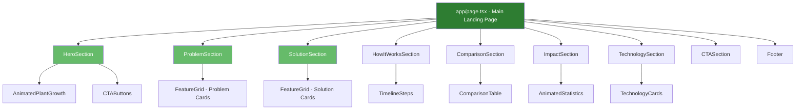
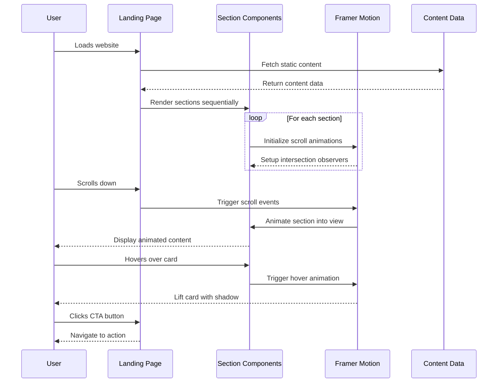

# Design Document: UMWERO Landing Website

## Overview

The UMWERO landing website is a modern, responsive marketing site for an AI-powered crop health intelligence platform targeting African farmers, particularly in Rwanda. The website transforms the default Next.js 16 structure into a compelling single-page application that communicates UMWERO's value proposition: providing localized crop health insights, offline-first support, and African language compatibility to address food security challenges. The design emphasizes a modern startup aesthetic blended with agricultural themes, using a green color palette that evokes growth, fertility, and technology working in harmony with nature.

The architecture follows Next.js 16 App Router conventions with TypeScript, leveraging server components for optimal performance and client components for interactive animations powered by Framer Motion. The modular component structure ensures maintainability and reusability while supporting responsive layouts that adapt seamlessly from mobile (single column) to tablet (2 columns) to desktop (3-4 columns).

## Architecture




## Main Algorithm/Workflow



## Components and Interfaces

### Component 1: HeroSection

**Purpose**: Captures attention with compelling headline, animated plant growth visual, and primary call-to-action buttons

**Interface**:
```typescript
interface HeroSectionProps {
  title: string;
  subtitle: string;
  primaryCTA: CTAButton;
  secondaryCTA: CTAButton;
}

interface CTAButton {
  text: string;
  href: string;
  variant: 'primary' | 'secondary';
}
```

**Responsibilities**:
- Display main value proposition with animated typography
- Render animated plant growth visual using Framer Motion
- Provide primary and secondary call-to-action buttons
- Implement responsive layout (full viewport height on desktop)
- Ensure accessibility with proper heading hierarchy


### Component 2: ProblemSection

**Purpose**: Articulates the challenges faced by African farmers to establish problem-solution fit

**Interface**:
```typescript
interface ProblemSectionProps {
  title: string;
  description: string;
  problems: ProblemCard[];
}

interface ProblemCard {
  id: string;
  icon: string;
  title: string;
  description: string;
}
```

**Responsibilities**:
- Display grid of problem cards (responsive: 1/2/3 columns)
- Animate cards on scroll using fade-in and slide-up effects
- Apply hover effects (lift and shadow) to cards
- Maintain consistent spacing and alignment

### Component 3: SolutionSection

**Purpose**: Presents UMWERO's key features and how they address farmer challenges

**Interface**:
```typescript
interface SolutionSectionProps {
  title: string;
  description: string;
  features: FeatureCard[];
}

interface FeatureCard {
  id: string;
  icon: string;
  title: string;
  description: string;
  highlight?: boolean;
}
```

**Responsibilities**:
- Render feature cards in responsive grid layout
- Highlight key differentiators (African crops, offline support, local languages)
- Implement staggered animation on scroll
- Support icon-based visual communication

### Component 4: HowItWorksSection

**Purpose**: Explains the 5-step user journey from photo capture to actionable insights

**Interface**:
```typescript
interface HowItWorksSectionProps {
  title: string;
  steps: ProcessStep[];
}

interface ProcessStep {
  id: string;
  stepNumber: number;
  title: string;
  description: string;
  icon: string;
}
```

**Responsibilities**:
- Display timeline or step-based progression
- Animate steps sequentially on scroll
- Show visual connection between steps (lines or arrows)
- Adapt layout for mobile (vertical) and desktop (horizontal/grid)


### Component 5: ComparisonSection

**Purpose**: Differentiates UMWERO from Plantix with side-by-side feature comparison

**Interface**:
```typescript
interface ComparisonSectionProps {
  title: string;
  description: string;
  comparison: ComparisonData;
}

interface ComparisonData {
  features: string[];
  umwero: ComparisonColumn;
  plantix: ComparisonColumn;
}

interface ComparisonColumn {
  name: string;
  logo?: string;
  values: (boolean | string)[];
}
```

**Responsibilities**:
- Render comparison table with clear visual hierarchy
- Use checkmarks/crosses for boolean features
- Highlight UMWERO's unique advantages
- Ensure mobile-friendly table layout (horizontal scroll or stacked)

### Component 6: ImpactSection

**Purpose**: Demonstrates potential impact through animated statistics and benefits

**Interface**:
```typescript
interface ImpactSectionProps {
  title: string;
  description: string;
  statistics: Statistic[];
  benefits: string[];
}

interface Statistic {
  id: string;
  value: number;
  unit: string;
  label: string;
  prefix?: string;
  suffix?: string;
}
```

**Responsibilities**:
- Animate numbers counting up when section enters viewport
- Display statistics in prominent, readable format
- List key benefits with visual indicators
- Create emotional connection through impact messaging

### Component 7: TechnologySection

**Purpose**: Showcases future technology vision and innovation roadmap

**Interface**:
```typescript
interface TechnologySectionProps {
  title: string;
  description: string;
  technologies: TechnologyCard[];
}

interface TechnologyCard {
  id: string;
  name: string;
  description: string;
  icon: string;
  status: 'planned' | 'in-development' | 'available';
}
```

**Responsibilities**:
- Display technology cards in grid layout
- Indicate development status with visual badges
- Animate cards on scroll with stagger effect
- Communicate innovation and forward-thinking approach


### Component 8: CTASection

**Purpose**: Final call-to-action encouraging collaboration and engagement

**Interface**:
```typescript
interface CTASectionProps {
  title: string;
  description: string;
  primaryCTA: CTAButton;
  secondaryCTA?: CTAButton;
  backgroundVariant?: 'default' | 'gradient' | 'image';
}
```

**Responsibilities**:
- Create urgency and encourage action
- Provide clear, prominent CTA buttons
- Support multiple CTA options (contact, demo, waitlist)
- Apply eye-catching background treatment

### Component 9: Footer

**Purpose**: Standard footer with navigation, social links, and legal information

**Interface**:
```typescript
interface FooterProps {
  logo: string;
  tagline: string;
  navigation: FooterNavSection[];
  socialLinks: SocialLink[];
  copyright: string;
}

interface FooterNavSection {
  title: string;
  links: NavLink[];
}

interface NavLink {
  text: string;
  href: string;
}

interface SocialLink {
  platform: string;
  href: string;
  icon: string;
}
```

**Responsibilities**:
- Organize footer content in responsive columns
- Provide navigation to key pages
- Display social media links
- Include copyright and legal information

### Component 10: FeatureGrid (Reusable)

**Purpose**: Reusable grid component for displaying cards with consistent styling

**Interface**:
```typescript
interface FeatureGridProps {
  items: GridItem[];
  columns?: {
    mobile: 1;
    tablet: 2;
    desktop: 3 | 4;
  };
  animationDelay?: number;
  variant?: 'card' | 'minimal' | 'bordered';
}

interface GridItem {
  id: string;
  icon?: string;
  title: string;
  description: string;
  metadata?: Record<string, any>;
}
```

**Responsibilities**:
- Render responsive grid with configurable columns
- Apply consistent card styling and spacing
- Implement scroll-triggered animations
- Support multiple visual variants


## Data Models

### Model 1: SiteContent

```typescript
interface SiteContent {
  metadata: SiteMetadata;
  hero: HeroContent;
  problem: ProblemContent;
  solution: SolutionContent;
  howItWorks: HowItWorksContent;
  comparison: ComparisonContent;
  impact: ImpactContent;
  technology: TechnologyContent;
  cta: CTAContent;
  footer: FooterContent;
}

interface SiteMetadata {
  title: string;
  description: string;
  keywords: string[];
  ogImage: string;
  twitterHandle?: string;
}
```

**Validation Rules**:
- All required fields must be non-empty strings
- URLs must be valid and properly formatted
- Keywords array must contain at least 3 items
- OG image must be absolute URL or valid path

### Model 2: ColorTheme

```typescript
interface ColorTheme {
  primary: string;        // #2E7D32 - deep agriculture green
  secondary: string;      // #66BB6A - fresh plant green
  accent: string;         // #F9A825 - sunlight/harvest gold
  background: string;     // #F5F7F6
  text: string;          // #1F2937
  textSecondary: string; // Derived from text with opacity
  success: string;       // Derived from primary
  error: string;         // For validation states
  warning: string;       // For alerts
}
```

**Validation Rules**:
- All color values must be valid hex codes
- Colors must meet WCAG AA contrast requirements
- Primary and secondary colors must be distinguishable

### Model 3: AnimationConfig

```typescript
interface AnimationConfig {
  duration: number;           // Animation duration in seconds
  delay: number;             // Delay before animation starts
  easing: string;            // Easing function name
  staggerChildren?: number;  // Delay between child animations
  viewport?: ViewportConfig; // Intersection observer config
}

interface ViewportConfig {
  once: boolean;    // Animate only once
  amount: number;   // Percentage of element visible to trigger (0-1)
  margin?: string;  // Margin around viewport
}
```

**Validation Rules**:
- Duration must be positive number (0.1 - 3.0 seconds recommended)
- Delay must be non-negative
- Viewport amount must be between 0 and 1
- Easing must be valid CSS easing function


### Model 4: ResponsiveLayout

```typescript
interface ResponsiveLayout {
  breakpoints: Breakpoints;
  spacing: SpacingScale;
  typography: TypographyScale;
}

interface Breakpoints {
  mobile: number;    // 0px
  tablet: number;    // 768px
  desktop: number;   // 1024px
  wide: number;      // 1440px
}

interface SpacingScale {
  xs: string;   // 0.25rem (4px)
  sm: string;   // 0.5rem (8px)
  md: string;   // 1rem (16px)
  lg: string;   // 1.5rem (24px)
  xl: string;   // 2rem (32px)
  '2xl': string; // 3rem (48px)
  '3xl': string; // 4rem (64px)
}

interface TypographyScale {
  h1: TypographyStyle;
  h2: TypographyStyle;
  h3: TypographyStyle;
  body: TypographyStyle;
  small: TypographyStyle;
}

interface TypographyStyle {
  fontSize: string;
  lineHeight: string;
  fontWeight: number;
  letterSpacing?: string;
}
```

**Validation Rules**:
- Breakpoints must be in ascending order
- Spacing values must use consistent units (rem recommended)
- Font sizes must be accessible (minimum 14px for body text)
- Line heights must ensure readability (1.4-1.8 for body text)

## Algorithmic Pseudocode

### Main Rendering Algorithm

```typescript
ALGORITHM renderLandingPage()
INPUT: siteContent of type SiteContent
OUTPUT: rendered React component tree

BEGIN
  ASSERT siteContent is validated and complete
  
  // Step 1: Initialize layout and theme
  theme ← initializeTheme(colorTheme)
  layout ← initializeResponsiveLayout()
  
  // Step 2: Render sections in order with scroll animations
  sections ← [
    HeroSection,
    ProblemSection,
    SolutionSection,
    HowItWorksSection,
    ComparisonSection,
    ImpactSection,
    TechnologySection,
    CTASection,
    Footer
  ]
  
  // Step 3: Apply animations to each section
  FOR each section IN sections DO
    ASSERT section has valid content data
    
    animationConfig ← getAnimationConfig(section.type)
    wrappedSection ← wrapWithScrollAnimation(section, animationConfig)
    
    renderSection(wrappedSection)
  END FOR
  
  ASSERT all sections rendered successfully
  
  RETURN completePage
END
```

**Preconditions**:
- siteContent is validated and contains all required sections
- Theme configuration is properly defined
- Framer Motion is installed and configured

**Postconditions**:
- All sections are rendered in correct order
- Scroll animations are properly initialized
- Page is responsive across all breakpoints

**Loop Invariants**:
- All previously rendered sections remain valid
- Animation configurations are consistent


### Scroll Animation Algorithm

```typescript
ALGORITHM applyScrollAnimation(component, config)
INPUT: component (React component), config (AnimationConfig)
OUTPUT: animated component with intersection observer

BEGIN
  // Step 1: Define animation variants
  variants ← {
    hidden: {
      opacity: 0,
      y: 50,
      scale: 0.95
    },
    visible: {
      opacity: 1,
      y: 0,
      scale: 1,
      transition: {
        duration: config.duration,
        delay: config.delay,
        ease: config.easing
      }
    }
  }
  
  // Step 2: Configure viewport detection
  viewportConfig ← {
    once: config.viewport.once,
    amount: config.viewport.amount,
    margin: config.viewport.margin
  }
  
  // Step 3: Wrap component with motion
  animatedComponent ← motion.div({
    initial: "hidden",
    whileInView: "visible",
    viewport: viewportConfig,
    variants: variants,
    children: component
  })
  
  RETURN animatedComponent
END
```

**Preconditions**:
- component is a valid React component
- config contains valid animation parameters
- Framer Motion is available in scope

**Postconditions**:
- Component animates when entering viewport
- Animation respects viewport configuration
- No performance degradation from animations

**Loop Invariants**: N/A (no loops in this algorithm)

### Responsive Grid Layout Algorithm

```typescript
ALGORITHM calculateGridLayout(items, breakpoint, columns)
INPUT: items (array of GridItem), breakpoint (string), columns (ResponsiveColumns)
OUTPUT: grid configuration object

BEGIN
  ASSERT items.length > 0
  ASSERT breakpoint IN ['mobile', 'tablet', 'desktop']
  
  // Step 1: Determine column count based on breakpoint
  columnCount ← MATCH breakpoint WITH
    | 'mobile' → columns.mobile
    | 'tablet' → columns.tablet
    | 'desktop' → columns.desktop
  END MATCH
  
  // Step 2: Calculate grid properties
  gap ← getSpacingValue('lg')
  
  gridConfig ← {
    display: 'grid',
    gridTemplateColumns: REPEAT(columnCount, '1fr'),
    gap: gap,
    width: '100%'
  }
  
  // Step 3: Calculate stagger delay for animations
  FOR i FROM 0 TO items.length - 1 DO
    items[i].animationDelay ← i * 0.1
  END FOR
  
  ASSERT gridConfig is valid CSS Grid configuration
  
  RETURN gridConfig
END
```

**Preconditions**:
- items array is non-empty
- breakpoint is one of the defined breakpoint values
- columns configuration is valid

**Postconditions**:
- Grid configuration matches breakpoint requirements
- Animation delays are properly staggered
- Layout is responsive and accessible

**Loop Invariants**:
- Animation delays increase monotonically
- All items receive valid delay values


### Animated Counter Algorithm

```typescript
ALGORITHM animateCounter(targetValue, duration, onUpdate)
INPUT: targetValue (number), duration (number in ms), onUpdate (callback function)
OUTPUT: animated number sequence

BEGIN
  ASSERT targetValue >= 0
  ASSERT duration > 0
  
  startTime ← getCurrentTime()
  startValue ← 0
  
  // Step 1: Define easing function
  FUNCTION easeOutQuart(t)
    RETURN 1 - (1 - t)^4
  END FUNCTION
  
  // Step 2: Animation loop
  FUNCTION animate()
    currentTime ← getCurrentTime()
    elapsed ← currentTime - startTime
    progress ← MIN(elapsed / duration, 1.0)
    
    // Apply easing
    easedProgress ← easeOutQuart(progress)
    currentValue ← startValue + (targetValue - startValue) * easedProgress
    
    // Update display
    onUpdate(ROUND(currentValue))
    
    // Continue animation if not complete
    IF progress < 1.0 THEN
      requestAnimationFrame(animate)
    END IF
  END FUNCTION
  
  // Step 3: Start animation
  requestAnimationFrame(animate)
END
```

**Preconditions**:
- targetValue is non-negative number
- duration is positive number
- onUpdate is a valid callback function
- requestAnimationFrame is available

**Postconditions**:
- Counter animates from 0 to targetValue
- Animation completes within specified duration
- onUpdate is called with each frame update
- Final value equals targetValue

**Loop Invariants**:
- progress value is always between 0 and 1
- currentValue never exceeds targetValue
- Animation frame requests are properly managed

## Key Functions with Formal Specifications

### Function 1: wrapWithScrollAnimation()

```typescript
function wrapWithScrollAnimation(
  component: React.ReactNode,
  config: AnimationConfig
): React.ReactElement
```

**Preconditions:**
- component is a valid React node (not null/undefined)
- config.duration is between 0.1 and 3.0 seconds
- config.viewport.amount is between 0 and 1
- Framer Motion library is installed and imported

**Postconditions:**
- Returns a valid React element wrapped with motion.div
- Animation triggers when element enters viewport
- Animation respects all configuration parameters
- No side effects on original component

**Loop Invariants:** N/A (no loops)


### Function 2: validateSiteContent()

```typescript
function validateSiteContent(content: unknown): content is SiteContent
```

**Preconditions:**
- content parameter is provided (may be any type)

**Postconditions:**
- Returns true if and only if content matches SiteContent interface
- Type guard ensures TypeScript type narrowing
- No mutations to input parameter
- Validation checks all required fields and nested structures

**Loop Invariants:**
- For validation loops: All previously checked fields remain valid

### Function 3: getResponsiveColumns()

```typescript
function getResponsiveColumns(
  breakpoint: Breakpoint,
  config: ResponsiveColumns
): number
```

**Preconditions:**
- breakpoint is one of: 'mobile' | 'tablet' | 'desktop'
- config contains valid column counts for all breakpoints
- Column counts are positive integers

**Postconditions:**
- Returns column count matching the breakpoint
- Return value is always a positive integer
- No side effects on input parameters

**Loop Invariants:** N/A (no loops)

### Function 4: initializeTheme()

```typescript
function initializeTheme(colors: ColorTheme): ThemeConfig
```

**Preconditions:**
- colors object contains all required color properties
- All color values are valid hex codes
- Colors meet WCAG AA contrast requirements

**Postconditions:**
- Returns complete theme configuration object
- Derived colors (hover states, shadows) are calculated
- CSS custom properties are generated
- Theme is ready for application-wide use

**Loop Invariants:**
- For color processing loops: All processed colors remain valid hex codes

### Function 5: calculateStaggerDelay()

```typescript
function calculateStaggerDelay(
  index: number,
  baseDelay: number,
  staggerAmount: number
): number
```

**Preconditions:**
- index is non-negative integer
- baseDelay is non-negative number
- staggerAmount is positive number

**Postconditions:**
- Returns delay value for animation
- Delay increases linearly with index
- Formula: baseDelay + (index * staggerAmount)
- Return value is always non-negative

**Loop Invariants:** N/A (no loops)


## Example Usage

```typescript
// Example 1: Main page composition
import { HeroSection } from '@/components/sections/HeroSection';
import { ProblemSection } from '@/components/sections/ProblemSection';
import { siteContent } from '@/data/content';

export default function LandingPage() {
  return (
    <main className="min-h-screen bg-background">
      <HeroSection {...siteContent.hero} />
      <ProblemSection {...siteContent.problem} />
      {/* Additional sections */}
    </main>
  );
}

// Example 2: Animated section with scroll trigger
'use client';

import { motion } from 'framer-motion';
import { fadeInUp } from '@/lib/animations';

export function ProblemSection({ title, problems }: ProblemSectionProps) {
  return (
    <motion.section
      initial="hidden"
      whileInView="visible"
      viewport={{ once: true, amount: 0.3 }}
      variants={fadeInUp}
      className="py-16 px-4"
    >
      <h2 className="text-4xl font-bold text-center mb-12">{title}</h2>
      <FeatureGrid items={problems} columns={{ mobile: 1, tablet: 2, desktop: 3 }} />
    </motion.section>
  );
}

// Example 3: Reusable FeatureGrid with stagger animation
'use client';

import { motion } from 'framer-motion';

export function FeatureGrid({ items, columns }: FeatureGridProps) {
  const containerVariants = {
    hidden: { opacity: 0 },
    visible: {
      opacity: 1,
      transition: {
        staggerChildren: 0.1
      }
    }
  };

  const itemVariants = {
    hidden: { opacity: 0, y: 20 },
    visible: { opacity: 1, y: 0 }
  };

  return (
    <motion.div
      variants={containerVariants}
      className={`grid gap-6 grid-cols-${columns.mobile} md:grid-cols-${columns.tablet} lg:grid-cols-${columns.desktop}`}
    >
      {items.map((item) => (
        <motion.div
          key={item.id}
          variants={itemVariants}
          whileHover={{ y: -8, boxShadow: '0 12px 24px rgba(0,0,0,0.1)' }}
          className="p-6 bg-white rounded-lg shadow-md"
        >
          <h3 className="text-xl font-semibold mb-2">{item.title}</h3>
          <p className="text-gray-600">{item.description}</p>
        </motion.div>
      ))}
    </motion.div>
  );
}

// Example 4: Animated counter for statistics
'use client';

import { useEffect, useState } from 'react';
import { useInView } from 'framer-motion';
import { useRef } from 'react';

export function AnimatedStatistic({ value, label, suffix }: StatisticProps) {
  const [count, setCount] = useState(0);
  const ref = useRef(null);
  const isInView = useInView(ref, { once: true });

  useEffect(() => {
    if (!isInView) return;

    const duration = 2000;
    const startTime = Date.now();

    const animate = () => {
      const elapsed = Date.now() - startTime;
      const progress = Math.min(elapsed / duration, 1);
      const eased = 1 - Math.pow(1 - progress, 4);
      
      setCount(Math.round(value * eased));

      if (progress < 1) {
        requestAnimationFrame(animate);
      }
    };

    animate();
  }, [isInView, value]);

  return (
    <div ref={ref} className="text-center">
      <div className="text-5xl font-bold text-primary">
        {count}{suffix}
      </div>
      <div className="text-lg text-gray-600 mt-2">{label}</div>
    </div>
  );
}

// Example 5: Theme configuration
export const theme: ColorTheme = {
  primary: '#2E7D32',
  secondary: '#66BB6A',
  accent: '#F9A825',
  background: '#F5F7F6',
  text: '#1F2937',
  textSecondary: 'rgba(31, 41, 55, 0.7)',
  success: '#2E7D32',
  error: '#DC2626',
  warning: '#F59E0B'
};

// Example 6: Content data structure
export const siteContent: SiteContent = {
  metadata: {
    title: 'UMWERO - AI-Powered Crop Health Intelligence for Africa',
    description: 'Empowering African farmers with localized crop health insights, offline support, and Kinyarwanda language compatibility.',
    keywords: ['agriculture', 'AI', 'crop health', 'Rwanda', 'Africa', 'farming'],
    ogImage: '/images/og-image.jpg'
  },
  hero: {
    title: 'Empowering African Farmers with AI-Powered Crop Intelligence',
    subtitle: 'Detect crop diseases, optimize yields, and secure food production with technology built for African agriculture',
    primaryCTA: {
      text: 'Join Waitlist',
      href: '#waitlist',
      variant: 'primary'
    },
    secondaryCTA: {
      text: 'Learn More',
      href: '#solution',
      variant: 'secondary'
    }
  },
  problem: {
    title: 'Challenges Facing African Farmers',
    description: 'Traditional crop health solutions fail to address the unique needs of African agriculture',
    problems: [
      {
        id: 'p1',
        icon: 'globe',
        title: 'Generic Solutions',
        description: 'Existing tools focus on Western crops, ignoring cassava, sorghum, and other African staples'
      },
      {
        id: 'p2',
        icon: 'wifi-off',
        title: 'Internet Dependency',
        description: 'Most solutions require constant connectivity, unusable in rural areas with limited internet'
      },
      {
        id: 'p3',
        icon: 'language',
        title: 'Language Barriers',
        description: 'Tools available only in English, excluding farmers who speak Kinyarwanda and other local languages'
      }
    ]
  }
  // Additional sections...
};
```


## Correctness Properties

### Property 1: Section Rendering Order
```typescript
// ∀ page renders, sections appear in specified order
property("sections render in correct order", () => {
  const expectedOrder = [
    'hero', 'problem', 'solution', 'howItWorks', 
    'comparison', 'impact', 'technology', 'cta', 'footer'
  ];
  
  const renderedSections = getRenderedSectionOrder(page);
  
  return arraysEqual(renderedSections, expectedOrder);
});
```

### Property 2: Responsive Layout Integrity
```typescript
// ∀ breakpoints, grid columns match configuration
property("grid columns match breakpoint configuration", (breakpoint) => {
  const config = { mobile: 1, tablet: 2, desktop: 3 };
  const actualColumns = getGridColumns(breakpoint);
  
  return actualColumns === config[breakpoint];
});
```

### Property 3: Animation Performance
```typescript
// ∀ animations, frame rate remains above 30fps
property("animations maintain acceptable frame rate", (animation) => {
  const frameRate = measureFrameRate(animation);
  
  return frameRate >= 30;
});
```

### Property 4: Content Validation
```typescript
// ∀ content objects, all required fields are present and valid
property("all content sections are valid", (sectionKey) => {
  const section = siteContent[sectionKey];
  const schema = getSchemaForSection(sectionKey);
  
  return validateAgainstSchema(section, schema);
});
```

### Property 5: Accessibility Compliance
```typescript
// ∀ interactive elements, keyboard navigation works
property("all interactive elements are keyboard accessible", (element) => {
  return element.tabIndex >= 0 && element.hasAttribute('role');
});
```

### Property 6: Color Contrast
```typescript
// ∀ text elements, contrast ratio meets WCAG AA (4.5:1)
property("text meets contrast requirements", (textElement) => {
  const contrastRatio = calculateContrastRatio(
    textElement.color,
    textElement.backgroundColor
  );
  
  return contrastRatio >= 4.5;
});
```

### Property 7: Animation Trigger Consistency
```typescript
// ∀ scroll animations, trigger when viewport threshold is met
property("animations trigger at correct viewport position", (section) => {
  const threshold = section.animationConfig.viewport.amount;
  const visibleAmount = getVisibleAmount(section);
  
  return visibleAmount >= threshold ? section.isAnimating : !section.isAnimating;
});
```

### Property 8: Responsive Image Loading
```typescript
// ∀ images, appropriate size is loaded for current viewport
property("images load correct size for viewport", (image, viewport) => {
  const expectedSize = getExpectedImageSize(viewport);
  const loadedSize = image.currentSrc.size;
  
  return loadedSize === expectedSize;
});
```


## Error Handling

### Error Scenario 1: Missing Content Data

**Condition**: Required content section is undefined or missing required fields
**Response**: 
- Log error to console with specific missing field information
- Render fallback content with placeholder text
- Display error boundary component in development mode
- Track error in monitoring system (production)

**Recovery**: 
- Use default content values from fallback configuration
- Allow page to continue rendering other sections
- Notify developers through error tracking service

### Error Scenario 2: Animation Performance Degradation

**Condition**: Frame rate drops below 30fps during animations
**Response**:
- Detect performance issues using requestAnimationFrame timing
- Automatically disable complex animations
- Fall back to simpler CSS transitions
- Log performance metrics for analysis

**Recovery**:
- Reduce animation complexity (remove blur, scale effects)
- Increase animation duration to reduce computational load
- Disable stagger effects on low-performance devices
- Maintain core functionality without animations

### Error Scenario 3: Image Loading Failure

**Condition**: Image fails to load (404, network error, timeout)
**Response**:
- Display placeholder with appropriate background color
- Show icon representing image type (logo, photo, illustration)
- Retry loading after 2-second delay (max 2 retries)
- Log error with image URL and error type

**Recovery**:
- Use fallback image from CDN or local assets
- Display text-only version of content if image is decorative
- Ensure layout remains stable without image
- Continue page functionality normally

### Error Scenario 4: Viewport Detection Failure

**Condition**: IntersectionObserver API not available or fails
**Response**:
- Detect browser support on component mount
- Fall back to scroll event listeners with throttling
- If both fail, show all content without animations
- Log browser compatibility issue

**Recovery**:
- Use CSS-only animations as fallback
- Display all content immediately (no lazy loading)
- Maintain full functionality without scroll-triggered effects
- Ensure accessibility is not compromised

### Error Scenario 5: Invalid Color Theme Configuration

**Condition**: Color values are invalid hex codes or fail contrast requirements
**Response**:
- Validate color values on theme initialization
- Throw descriptive error in development mode
- Use default theme colors in production
- Log validation errors with specific failing colors

**Recovery**:
- Replace invalid colors with default theme values
- Recalculate derived colors (hover states, shadows)
- Ensure WCAG compliance with fallback colors
- Continue rendering with safe color palette


## Testing Strategy

### Unit Testing Approach

**Framework**: Vitest with React Testing Library

**Key Test Cases**:

1. **Component Rendering**
   - Each section component renders without errors
   - Props are correctly passed and displayed
   - Conditional rendering works as expected
   - Default props are applied when optional props are missing

2. **Data Validation**
   - validateSiteContent() correctly identifies valid content
   - validateSiteContent() rejects invalid content structures
   - Color theme validation catches invalid hex codes
   - Animation config validation enforces valid ranges

3. **Utility Functions**
   - getResponsiveColumns() returns correct values for each breakpoint
   - calculateStaggerDelay() produces correct delay sequences
   - Color contrast calculation meets WCAG standards
   - Theme initialization generates all required CSS variables

4. **Responsive Behavior**
   - Grid layouts adjust to breakpoint changes
   - Typography scales appropriately
   - Spacing remains consistent across viewports
   - Images load correct sizes for viewport

**Coverage Goals**: Minimum 80% code coverage for utility functions and component logic

### Property-Based Testing Approach

**Property Test Library**: fast-check (for TypeScript/JavaScript)

**Property Tests**:

1. **Animation Timing Properties**
```typescript
test('animation delays are always non-negative and increase monotonically', () => {
  fc.assert(
    fc.property(
      fc.array(fc.nat(100), { minLength: 1, maxLength: 20 }),
      fc.float({ min: 0, max: 1 }),
      (indices, staggerAmount) => {
        const delays = indices.map((_, i) => calculateStaggerDelay(i, 0, staggerAmount));
        
        // All delays are non-negative
        const allNonNegative = delays.every(d => d >= 0);
        
        // Delays increase monotonically
        const isMonotonic = delays.every((d, i) => 
          i === 0 || d >= delays[i - 1]
        );
        
        return allNonNegative && isMonotonic;
      }
    )
  );
});
```

2. **Grid Layout Properties**
```typescript
test('grid columns always match breakpoint configuration', () => {
  fc.assert(
    fc.property(
      fc.constantFrom('mobile', 'tablet', 'desktop'),
      fc.record({
        mobile: fc.constant(1),
        tablet: fc.integer({ min: 1, max: 2 }),
        desktop: fc.integer({ min: 2, max: 4 })
      }),
      (breakpoint, config) => {
        const columns = getResponsiveColumns(breakpoint, config);
        return columns === config[breakpoint] && columns > 0;
      }
    )
  );
});
```

3. **Color Validation Properties**
```typescript
test('valid hex colors always pass validation', () => {
  fc.assert(
    fc.property(
      fc.hexaString({ minLength: 6, maxLength: 6 }),
      (hexColor) => {
        const color = `#${hexColor}`;
        return isValidHexColor(color);
      }
    )
  );
});
```

4. **Content Validation Properties**
```typescript
test('content with all required fields always validates', () => {
  fc.assert(
    fc.property(
      fc.record({
        title: fc.string({ minLength: 1 }),
        description: fc.string({ minLength: 1 }),
        items: fc.array(fc.record({
          id: fc.string({ minLength: 1 }),
          title: fc.string({ minLength: 1 }),
          description: fc.string({ minLength: 1 })
        }), { minLength: 1 })
      }),
      (content) => {
        return validateSectionContent(content);
      }
    )
  );
});
```

### Integration Testing Approach

**Framework**: Playwright for end-to-end testing

**Integration Test Scenarios**:

1. **Full Page Load and Render**
   - Page loads without errors
   - All sections render in correct order
   - Images load successfully
   - No console errors or warnings

2. **Scroll Animation Flow**
   - Sections animate as user scrolls down page
   - Animations trigger at correct viewport positions
   - Animations complete without performance issues
   - Multiple animations don't conflict

3. **Responsive Behavior**
   - Layout adapts correctly at each breakpoint
   - Mobile navigation works properly
   - Touch interactions function on mobile devices
   - No horizontal scrolling on any viewport size

4. **Interactive Elements**
   - CTA buttons navigate to correct destinations
   - Hover effects work on desktop
   - Focus states are visible for keyboard navigation
   - All links are functional

5. **Performance Metrics**
   - First Contentful Paint < 1.5s
   - Largest Contentful Paint < 2.5s
   - Time to Interactive < 3.5s
   - Cumulative Layout Shift < 0.1

**Test Environments**: Desktop (1920x1080), Tablet (768x1024), Mobile (375x667)


## Performance Considerations

### Optimization Strategy

1. **Code Splitting**
   - Use Next.js automatic code splitting for route-based chunks
   - Lazy load Framer Motion only for client components that need animations
   - Split large content data into separate modules
   - Dynamic imports for heavy components (comparison table, technology cards)

2. **Image Optimization**
   - Use Next.js Image component for automatic optimization
   - Implement responsive images with srcset for different viewports
   - Use WebP format with JPEG fallback
   - Lazy load images below the fold
   - Optimize hero image for LCP (Largest Contentful Paint)

3. **Animation Performance**
   - Use CSS transforms (translate, scale) instead of position properties
   - Leverage GPU acceleration with will-change hints
   - Implement intersection observer for scroll-triggered animations
   - Disable animations on low-performance devices (prefers-reduced-motion)
   - Limit simultaneous animations to prevent frame drops

4. **Bundle Size Optimization**
   - Tree-shake unused Framer Motion features
   - Use Tailwind CSS purge to remove unused styles
   - Minimize third-party dependencies
   - Implement font subsetting for Google Fonts
   - Target bundle size < 200KB (gzipped)

5. **Rendering Strategy**
   - Use Server Components for static content sections
   - Client Components only for interactive/animated elements
   - Implement streaming SSR for faster initial page load
   - Preload critical resources (fonts, hero image)
   - Optimize CSS delivery (inline critical CSS)

### Performance Targets

- **First Contentful Paint (FCP)**: < 1.5 seconds
- **Largest Contentful Paint (LCP)**: < 2.5 seconds
- **Time to Interactive (TTI)**: < 3.5 seconds
- **Cumulative Layout Shift (CLS)**: < 0.1
- **First Input Delay (FID)**: < 100ms
- **Total Bundle Size**: < 200KB (gzipped)
- **Animation Frame Rate**: > 30fps (target 60fps)

### Monitoring

- Implement Core Web Vitals tracking
- Use Next.js Analytics for performance monitoring
- Set up performance budgets in CI/CD pipeline
- Monitor bundle size changes in pull requests
- Track real user metrics (RUM) in production


## Security Considerations

### Content Security Policy (CSP)

Implement strict CSP headers to prevent XSS attacks:

```typescript
// next.config.ts
const securityHeaders = [
  {
    key: 'Content-Security-Policy',
    value: [
      "default-src 'self'",
      "script-src 'self' 'unsafe-eval' 'unsafe-inline'",
      "style-src 'self' 'unsafe-inline' https://fonts.googleapis.com",
      "font-src 'self' https://fonts.gstatic.com",
      "img-src 'self' data: https:",
      "connect-src 'self'"
    ].join('; ')
  }
];
```

### Input Validation

- Validate all user inputs (email, contact forms) on both client and server
- Sanitize user-generated content before rendering
- Use TypeScript for type safety and compile-time validation
- Implement rate limiting for form submissions

### External Resources

- Load fonts from trusted CDN (Google Fonts)
- Use Subresource Integrity (SRI) for external scripts
- Implement HTTPS-only policy
- Validate all external links before rendering

### Data Protection

- No sensitive data stored in client-side code
- Environment variables for API keys and secrets
- Implement proper CORS policies for API endpoints
- Use secure cookies for any session management

### Dependency Security

- Regular dependency audits using `bun audit`
- Keep Next.js and React updated to latest stable versions
- Monitor security advisories for Framer Motion and other dependencies
- Use Dependabot for automated security updates

### Accessibility Security

- Prevent clickjacking with X-Frame-Options header
- Implement proper ARIA labels to prevent screen reader exploits
- Ensure keyboard navigation doesn't expose hidden content
- Validate color contrast to prevent visual accessibility issues


## Dependencies

### Core Dependencies

**Production Dependencies**:
- `next@16.1.6` - React framework with App Router, server components, and image optimization
- `react@19.2.3` - UI library for component-based architecture
- `react-dom@19.2.3` - React rendering for web
- `framer-motion@^11` - Animation library for scroll-triggered and interactive animations
- `tailwindcss@^4` - Utility-first CSS framework for styling
- `@tailwindcss/postcss@^4` - PostCSS plugin for Tailwind CSS v4

**Development Dependencies**:
- `typescript@^5` - Type safety and developer experience
- `@types/node@^20` - TypeScript definitions for Node.js
- `@types/react@^19` - TypeScript definitions for React
- `@types/react-dom@^19` - TypeScript definitions for React DOM
- `@biomejs/biome@2.2.0` - Fast linter and formatter
- `babel-plugin-react-compiler@1.0.0` - React compiler for optimization

### Testing Dependencies (To Be Added)

- `vitest@^1` - Fast unit test framework
- `@testing-library/react@^14` - React component testing utilities
- `@testing-library/jest-dom@^6` - Custom Jest matchers for DOM
- `@playwright/test@^1` - End-to-end testing framework
- `fast-check@^3` - Property-based testing library

### Optional Dependencies

- `sharp@^0.33` - Image optimization (already trusted in package.json)
- `@vercel/analytics@^1` - Performance monitoring (if deploying to Vercel)
- `@next/bundle-analyzer@^16` - Bundle size analysis

### Font Dependencies

- Google Fonts: Geist Sans and Geist Mono (already configured)
- Loaded via next/font/google for optimal performance

### Browser Support

**Target Browsers**:
- Chrome/Edge: Last 2 versions
- Firefox: Last 2 versions
- Safari: Last 2 versions
- Mobile Safari: iOS 14+
- Chrome Android: Last 2 versions

**Required Browser APIs**:
- IntersectionObserver (for scroll animations)
- requestAnimationFrame (for smooth animations)
- CSS Grid (for responsive layouts)
- CSS Custom Properties (for theming)
- ES2020+ features (supported by Next.js transpilation)

### External Services

**Required**:
- None (fully self-contained landing page)

**Optional**:
- Email service provider (for contact form submissions)
- Analytics service (Google Analytics, Plausible, or Vercel Analytics)
- Error tracking (Sentry, LogRocket)
- CDN for static assets (Vercel Edge Network, Cloudflare)

### Installation Commands

```bash
# Install Framer Motion
bun add framer-motion

# Install testing dependencies
bun add -d vitest @testing-library/react @testing-library/jest-dom @playwright/test fast-check

# Install optional analytics
bun add @vercel/analytics

# Install bundle analyzer
bun add -d @next/bundle-analyzer
```

### Version Constraints

- Node.js: >= 18.17.0 (required by Next.js 16)
- Bun: >= 1.0.0 (project uses Bun runtime)
- TypeScript: >= 5.0.0 (for latest React 19 types)

